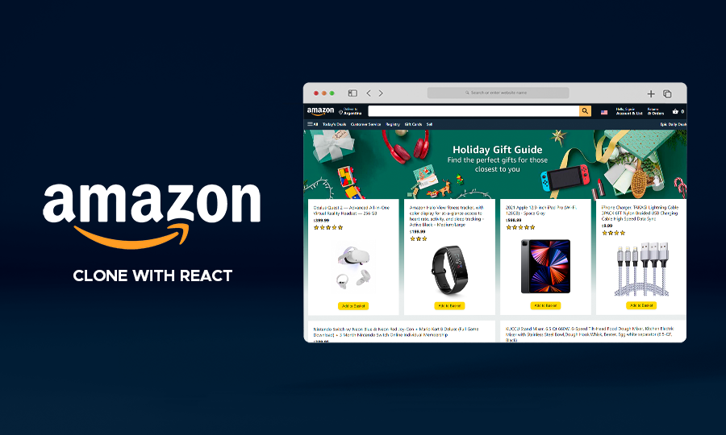
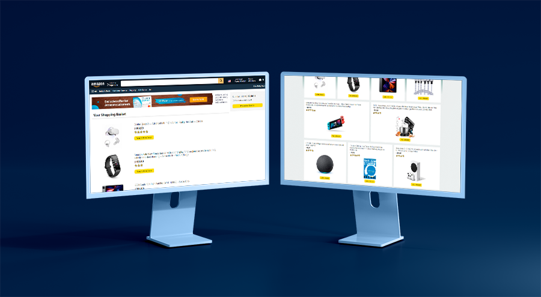

# Amazon Clone with React

### [Live Demo](https://amzn-clone-react04-jg.netlify.app/)

_Disclaimer: This project was done for educational purposes only._

## Stack

- React
- Styled Components

## Features

- Home page with products cards and the possibility to add to shopping basket any product.
- Shopping Basket page with the selected products and the subtotal for payment.
- Login and User Register pages.

___

## Getting Started with Create React App

This project was bootstrapped with [Create React App](https://github.com/facebook/create-react-app).

### Available Scripts

In the project directory, you can run:

#### `npm install`

#### `npm start`
